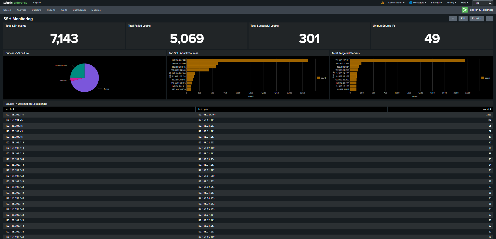
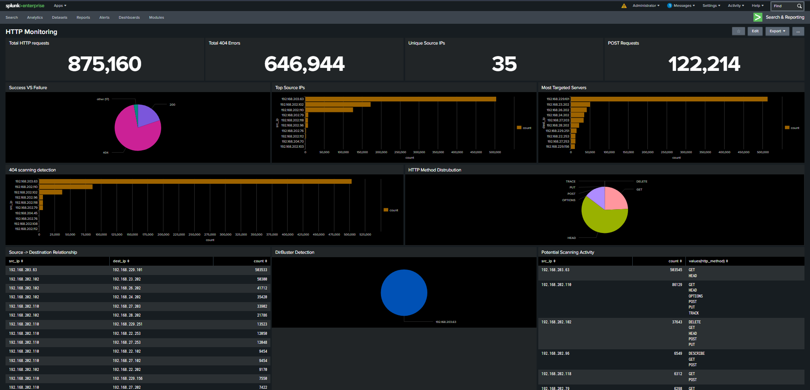

# Splunk SOC Monitoring Lab

A Splunk-based SOC monitoring project focused on SSH and HTTP log analysis, threat detection, attack visualization, and security monitoring using SPL queries and custom dashboards.

---

# Features

- SSH authentication monitoring
- HTTP traffic analysis
- Brute-force detection
- 404 reconnaissance detection
- DirBuster scanning detection
- Source-to-destination traffic analysis
- Security dashboard visualization
- SPL-based threat hunting
- Security event analysis

---

# Project Architecture

```text
SSH Logs / HTTP Logs
          ↓
      Splunk SIEM
          ↓
   Field Extraction
          ↓
      SPL Queries
          ↓
 Dashboards & Detection
```

---

# SSH Monitoring Dashboard



## SSH Dashboard Features

- Failed login monitoring
- Successful login tracking
- Top SSH attack source analysis
- Most targeted server analysis
- Source-to-destination relationship tracking
- Authentication statistics visualization

---

# HTTP Monitoring Dashboard



## HTTP Dashboard Features

- HTTP traffic monitoring
- 404 scanning detection
- DirBuster detection
- Top source IP analysis
- Targeted server monitoring
- HTTP status code analysis
- Potential scanning activity analysis

---

# SSH Security Detections

## Failed Login Detection

Detects SSH authentication failures to identify brute-force or password spraying activity.

## Top SSH Attack Sources

Identifies source IPs generating large numbers of SSH authentication attempts.

## Most Targeted Servers

Highlights destination systems receiving high SSH traffic volumes.

## Source to Destination Relationships

Maps attacker-to-target relationships for investigation purposes.

---

# HTTP Security Detections

## 404 Scanning Detection

Detects excessive failed HTTP requests that may indicate reconnaissance or directory enumeration attempts.

## DirBuster Detection

Detects OWASP DirBuster scanning activity used for web directory brute-forcing.

## Top Source IP Detection

Identifies the most active or suspicious web traffic sources.

## HTTP Status Code Analysis

Analyzes HTTP response distributions such as 200, 404, and 400 responses.

## Potential Scanning Activity

Identifies abnormal request behavior associated with automated scanning tools.

---

# Technologies Used

- Splunk Enterprise
- SPL (Search Processing Language)
- SSH Logs
- HTTP Logs
- Security Monitoring
- Threat Hunting
- SIEM Dashboarding
- Log Parsing & Field Extraction

---

# Key Learning Outcomes

- Log onboarding and parsing
- Field extraction and normalization
- SPL query development
- SIEM dashboard creation
- Security event analysis
- Threat hunting fundamentals
- Reconnaissance detection
- Security visualization techniques

---

# Repository Structure

```text
splunk-soc-monitoring-lab/
│
├── README.md
│
├── screenshots/
│   ├── ssh_dashboard.png
│   ├── http_dashboard.png
│   ├── ssh_sample_query.png
│   ├── http_sample_query.png
│   ├── parsed_ssh_fields.png
│   └── parsed_http_fields.png
│
├── queries/
│   ├── ssh_queries.md
│   └── http_queries.md
│
├── sample_logs/
│   ├── ssh_log_sample.txt
│   └── http_log_sample.txt
│
└── docs/
    ├── architecture.md
    ├── detections.md
    └── findings.md
```

---

# Future Improvements

- Real-time log forwarding
- Threat intelligence integration
- MITRE ATT&CK mapping
- Alert automation
- Advanced anomaly detection
- Real-time alerting workflows

---

## Sample Logs

Small sanitized log samples are included for demonstration purposes. Full datasets were not uploaded due to size considerations.

---

# Author

Archit Mishra